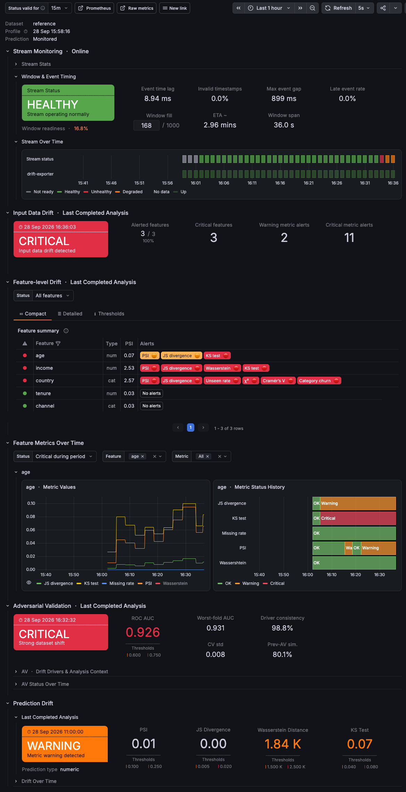

# Data Drift Guardian

Сервис мониторинга **data drift** для offline- и realtime-сценариев: строит reference-профиль, считает feature/prediction drift, выполняет adversarial validation, принимает события из Kafka, экспортирует метрики в Prometheus и визуализирует состояние в Grafana с provisioned alert rules .

---



---

## Что умеет

**Drift-анализ**
- numeric и categorical features, 10 метрик (PSI, JS divergence, KS, Cramér's V и др.)
- отдельный мониторинг prediction drift
- global thresholds с feature-level overrides
- автогенерация конфига и автокалибровка thresholds по reference-данным
- adversarial validation на LightGBM с CV diagnostics и feature importance 

**Realtime**
- Kafka ingestion полными непересекающимися окнами
- stream-health по event-time метрикам
- Prometheus exporter
- Grafana dashboard + provisioned alerting с защитой от единичных всплесков 

**Offline**
- HTML report с drift-сводкой, prediction drift и AV
- CLI для рендера отчёта из сохранённого JSON 

**Demo и тесты**
- локальный demo-режим с Kafka и producer, умеющим создавать контролируемый drift
- интеграционные тесты с реальной Kafka через `testcontainers` 

---

## Архитектура

### Realtime

```text
reference dataset + config.yaml
            │
            ▼
      OfflineWrapper / Core
            ▲
            │ current window
            │
external Kafka OR local demo Kafka
            │
            ▼
      Kafka consumer
            │
            ▼
 KafkaEvent → WindowBuffer
            │
      full WINDOW_SIZE
            │
            ▼
       pandas.DataFrame
            │
            ├── feature drift
            ├── prediction drift
            └── scheduled AV
            │
            ▼
    PrometheusExporter
            │
            ▼
       Prometheus
            │
            ▼
 Grafana dashboard + alerting
```

Realtime-слой отвечает за Kafka ingestion, оконную обработку, stream-health и Prometheus export. Расчёт drift-метрик, thresholds и AV выполняется через единый analyzer/Core .

### Offline

```text
OfflineWrapper(reference_df)
          │
          ├── analyze_df(current_df)
          └── run_av(current_df) (опционально)
          │
          ▼
generate_html_report()
          │
          ▼
     HTML report
```
---

## Быстрый старт

Требуется Python `>= 3.13`, [`uv`](https://docs.astral.sh/uv/), Docker Engine и Docker Compose v2 .

### 1. Установка

```bash
uv sync --frozen
```

### 2. Reference dataset

Analyzer ожидает CSV по пути `data/reference.csv` (в контейнере — `/app/data/reference.csv`). Файла в репозитории нет, подготовьте его до запуска analyzer одним из способов :

```bash
# вариант A: положить свой CSV
cp /path/to/your.csv data/reference.csv

# вариант B: скачать по URL из .env (DATASET_URL=...)
# в .env уже есть ссылка на демонстрационный датасет
uv run python tools/get_demo_data.py
```

Скрипт поддерживает прямые ссылки и Google Drive, распознаёт ZIP/GZIP . Подробнее — [docs/reference-data.md](docs/reference-data.md).

### 3. Config

Checked-in `config/config.yaml` для демонстрационного датасета из .env мониторит `age`, `income`, `country` и `prediction_score` . Для другого датасета сгенерируйте конфиг:

```bash
uv run python tools/build_config.py
```

> Генератор по умолчанию выключает prediction monitoring и AV. Перед запуском отредактируйте блок `OPTIONS` в начале `tools/build_config.py` — инструкции есть в самом файле . См. [docs/configuration.md](docs/configuration.md).

### 4. Запуск локального demo

```bash
docker compose --profile realtime --profile local-kafka up -d --build
```

Поднимутся `analyzer`, `kafka`, `drift-producer`, `prometheus`, `grafana` .

| Endpoint | URL |
|---|---|
| Analyzer metrics | http://localhost:8000/metrics |
| Prometheus | http://localhost:9090 |
| Grafana | http://localhost:3000 |

Проверка:

```bash
docker compose --profile realtime --profile local-kafka ps -a
docker compose --profile realtime --profile local-kafka logs --tail=200 analyzer

# Linux / macOS
curl -s http://localhost:8000/metrics | grep drift_
```

<details>
<summary>PowerShell</summary>

```powershell
curl.exe -s http://localhost:8000/metrics | Select-String "drift_"
```

</details>

Подробнее о режиме — [Основной demo-режим](#основной-demo-режим-realtime--local-kafka).

### 5. Настроить demo drift (опционально)

Сценарий producer'а — `tools/demo_producer/drift_config.yaml`. Поддерживаются типы `shift`, `scale`, `noise`, `categorical_swap` с параметрами `start_step` и `ramp_steps` .

> **Важно:** правило применяется только если имя feature присутствует в reference dataset. Если в `drift_config.yaml` указан `feature_1`, а в датасете есть `age` — правило будет молча пропущено .

Пример сценария и полный список параметров — [docs/demo-producer.md](docs/demo-producer.md).

---

## Режимы запуска

| Profile | Сервисы | Назначение |
|---|---|---|
| без profile | `prometheus`, `grafana` | общая monitoring-инфраструктура |
| `mock` | `drift-mock-exporter` | mock Prometheus contract без Kafka и Core |
| `realtime` | `analyzer` | Kafka consumer + Core + exporter |
| `local-kafka` | `kafka`, `drift-producer` | локальный demo broker и producer |
| **`realtime + local-kafka`** | **всё выше** | **основной demo-режим** |

### Основной demo-режим (`realtime + local-kafka`)

Полный локальный стек: analyzer, локальный Kafka broker, producer с контролируемым drift, Prometheus и Grafana. Это режим по умолчанию для знакомства с проектом .

```bash
docker compose --profile realtime --profile local-kafka up -d --build
```

| Endpoint | URL |
|---|---|
| Analyzer metrics | http://localhost:8000/metrics |
| Prometheus | http://localhost:9090 |
| Grafana | http://localhost:3000 |

Проверка состояния:

```bash
docker compose --profile realtime --profile local-kafka ps -a
docker compose --profile realtime --profile local-kafka logs --tail=200 analyzer
docker compose --profile realtime --profile local-kafka logs --tail=100 drift-producer
```

Первый анализ появится после того, как producer наберёт полное окно — при `WINDOW_SIZE=1000` и `PRODUCER_INTERVAL_SECONDS=0.2` это примерно 3–4 минуты .

### Realtime с внешней Kafka (`realtime`)

Задайте в `.env` и запустите **только** `realtime` — локальные `kafka` и `drift-producer` не поднимутся :

```env
KAFKA_BOOTSTRAP_SERVERS=broker1:9092
KAFKA_TOPIC=features-stream
KAFKA_GROUP_ID=drift-consumer
```

```bash
docker compose --profile realtime up -d --build
```

> Topic должен быть создан владельцем кластера — проект его не создаёт. Для защищённого кластера (SASL/SSL) потребуется отдельная конфигурация клиента: сейчас consumer параметризует только `bootstrap.servers`, `group.id` и topic . Детали — [docs/external-kafka.md](docs/external-kafka.md).

### Mock-режим (`mock`)

Проверка Grafana/Prometheus/alerting без Kafka и Core :

```bash
docker compose --profile mock up -d --build
```

### Смена режима

`analyzer` и `drift-mock-exporter` публикуют один host port `8000`, поэтому одновременно работать не могут . Перед переключением остановите и удалите предыдущие сервисы:

```bash
docker compose --profile mock --profile realtime --profile local-kafka rm -sf \
  analyzer drift-mock-exporter drift-producer kafka
```

Prometheus и Grafana не принадлежат ни одному profile и могут оставаться поднятыми между режимами .

### Полный останов

```bash
docker compose --profile mock --profile realtime --profile local-kafka down --remove-orphans

# вместе с volume Grafana
docker compose --profile mock --profile realtime --profile local-kafka down --remove-orphans --volumes
```

---

## Drift metrics

| Metric | Numeric | Categorical | Примечание |
|---|:---:|:---:|---|
| `missing_rate` | ✓ | ✓ | доля пропусков |
| `psi` | ✓ | ✓ | Population Stability Index |
| `js_divergence` | ✓ | ✓ | Jensen-Shannon divergence |
| `wasserstein_distance` | ✓ | — | зависит от масштаба feature |
| `kstest` | ✓ | — | KS D-statistic, не p-value |
| `unseen_category_rate` | — | ✓ | доля новых категорий |
| `cardinality_ratio` | — | ✓ | изменение cardinality |
| `chi2` | — | ✓ | p-value: **меньше = хуже**, `warning > critical` |
| `cramer_v` | — | ✓ | Cramér's V |
| `category_churn` | — | ✓ | изменение состава категорий |

Thresholds задаются глобально и переопределяются на уровне feature (`feature local > global`) . Полная семантика, примеры YAML и prediction drift — [docs/metrics.md](docs/metrics.md).

---

## Prometheus contract

```text
# drift
drift_overall_status
drift_active_alerts
drift_status_feature{feature,type}
drift_metric_value{feature,type,metric}
drift_status{feature,type,metric}
drift_threshold{metric,level}
drift_resolved_threshold{feature,type,metric,level}

# window / runtime
drift_window_size
drift_current_window_events
drift_events_processed_total
drift_analysis_runs_total
drift_last_analysis_age_seconds
drift_report_timestamp_seconds

# stream health
drift_stream_status
drift_event_time_lag_seconds
drift_window_time_span_seconds
drift_max_event_gap_seconds
drift_invalid_event_time_rate
drift_late_event_rate
drift_late_events_total
drift_out_of_order_events_total

# adversarial validation
drift_av_status
drift_av_available
drift_av_roc_auc
drift_av_roc_auc_cv_{mean,min,max,std}
drift_av_driver_consistency
drift_av_driver_similarity_previous
drift_av_feature_importance{feature,rank}
drift_av_last_run_timestamp_seconds
drift_av_reference_rows
drift_av_current_rows
drift_av_features_evaluated

# streaks (для alerting)
drift_overall_status_streak
drift_status_feature_streak
drift_status_streak
drift_av_status_streak
```

**Status codes:**

```text
-1 = insufficient_data / not configured
 0 = ok
 1 = warning
 2 = critical
```

Analyzer и mock exporter скрейпятся как отдельные targets, но relabel'ятся в общий `job="drift-exporter"`; различаются стандартным label `instance` .

Семантика каждой метрики — [docs/prometheus-contract.md](docs/prometheus-contract.md).

---

## Grafana dashboard

Дашборд показывает состояние потока, результаты последнего завершённого анализа и изменения метрик и статусов во времени.

- **Stream Monitoring** — состояние потока и заполнение текущего окна. **Stream Stats** показывает число обработанных событий, запусков анализа, опоздавших и пришедших не по порядку событий — с момента запуска экспортера и за выбранный период. **Window & Event Timing** содержит показатели текущего окна и времени событий; **Stream Over Time** — историю состояния потока.
- **Input Data Drift** — общий статус последнего анализа, число признаков со статусом warning или critical и количество метрик с этими статусами.
- **Feature-level Drift** — результаты по признакам. **Compact** показывает статус и тип признака, PSI и метрики со статусом warning или critical. **Detailed** разделяет числовые и категориальные признаки и показывает значения и статусы метрик с настроенными порогами; состав колонок зависит от типа признака. **Thresholds** показывает пороги. Доступны фильтры по статусу и типу признака.
- **Feature Metrics Over Time** — значения метрик и история их статусов. Фильтры позволяют выбрать статус за период, признаки и метрики.
- **Adversarial Validation** — статус последнего запуска, ROC AUC и диагностические показатели. Ниже показаны признаки, по которым модель различает выборки, их важность, размеры и покрытие выборок AV, пороги AUC и история статуса AV.
- **Prediction Drift** — статус последнего анализа предсказаний и история дрифта. Метрики с настроенными порогами отображаются автоматически вместе со значениями и порогами.

В верхней части указаны dataset, время создания reference-профиля и состояние мониторинга предсказаний.

---

## Offline report

Офлайн-режим сравнивает готовые выборки `reference` и `current` без Kafka и Grafana. Он создаёт HTML-отчёт со сводкой Input Data Drift, таблицами по признакам и, если включён мониторинг предсказаний, разделом Prediction Drift. Adversarial Validation (AV) запускается по желанию.

```python
import pandas as pd

from drift_guardian.analyzer.offline.offline_mode import OfflineWrapper
from drift_guardian.config_handler.auto_config_builder import ConfigBuildOptions
from drift_guardian.reporting import generate_html_report

reference_df = pd.read_csv("data/reference.csv")
current_df = pd.read_csv("data/current.csv")

analyzer = OfflineWrapper(
    reference_df=reference_df,
    config_options=ConfigBuildOptions(
        prediction_enabled=True,
        prediction_score_column="prediction_score",
    ),
)

report = analyzer.analyze_df(current_df)

# Опционально: Adversarial Validation
av_report = analyzer.run_av(
    current_df,
    prediction_col="prediction_score",
)

html_path = generate_html_report(
    report=report,
    av_report=av_report,
    dataset_name="Offline drift demo",
    output_path="reports/offline_drift_report.html",
)
```

HTML-отчёт будет сохранён в `reports/offline_drift_report.html`. Если AV не нужна, уберите вызов `run_av()` и аргумент `av_report`.

Пошаговый пример с искусственно созданными выборками — в [`notebooks/offline_report_demo.ipynb`](notebooks/offline_report_demo.ipynb). Для его запуска установите зависимости: `uv sync --frozen --group notebooks`. Описание API, состава отчёта и создания HTML из сохранённого JSON — в [docs/offline.md](docs/offline.md).

---

## Тесты

```bash
# unit, без Docker
uv run pytest -q --ignore=tests/integration

# integration: поднимает apache/kafka:4.3.1 через testcontainers, нужен живой Docker daemon
uv run pytest -q -m integration

# всё
uv run pytest -q
```

Integration suite покрывает Kafka roundtrip, ожидание broker/topic, формирование полных окон, отсутствие анализа partial window, offset commit, восстановление после bad window, invalid messages, stream metrics, AV behavior и reconnect.

---

## Структура репозитория

```text
config/config.yaml                     # runtime config
data/                                  # локальные reference-данные (gitignored)

src/drift_guardian/
  analyzer/                            # Core drift engine, metrics, AV, offline wrapper
  config_handler/                       # config parser + auto config builder
  data_quality_checker/                 # schema validation
  exporters/                            # Prometheus exporter
  ingestion/                            # Kafka consumer, windows, stream-health, runtime
  profiler/                             # reference profiling
  reporting/                            # offline HTML report

monitoring/
  grafana/                              # dashboard + provisioning (datasources, dashboards, alerting)
  prometheus/                           # scrape config
  mock_exporter/                        # mock monitoring contract

tools/
  build_config.py                       # генерация config/config.yaml
  get_demo_data.py                      # загрузка reference dataset по URL
  demo_producer/                        # локальный Kafka producer + drift scenario

notebooks/ 
  demo_utils.py                         # данные для offline demo
  offline_report_demo.ipynb             # пример offline-анализа и HTML-отчёта

tests/integration/                      # Kafka integration tests via testcontainers
```

Проект использует `src` layout.

---

## Переменные окружения

| Переменная | Default | Назначение |
|---|---:|---|
| `KAFKA_BOOTSTRAP_SERVERS` | `kafka:19092` | Kafka bootstrap servers |
| `KAFKA_TOPIC` | `features-stream` | input topic |
| `KAFKA_GROUP_ID` | `drift-consumer` | consumer group |
| `KAFKA_STARTUP_TIMEOUT_SECONDS` | `60` | timeout ожидания Kafka/topic |
| `KAFKA_STARTUP_RETRY_SECONDS` | `1` | retry interval |
| `WINDOW_SIZE` | `1000` | размер analysis window |
| `LATE_EVENT_THRESHOLD_SECONDS` | `60` | event считается late после этого lag |
| `REFERENCE_DATA_PATH` | `/app/data/reference.csv` | reference dataset внутри analyzer |
| `ADVERSARIAL_TOP_FEATURES` | `10` | число AV drivers в exporter |
| `AV_WARNING_THRESHOLD` | `0.60` | AV warning ROC AUC |
| `AV_CRITICAL_THRESHOLD` | `0.75` | AV critical ROC AUC |
| `PRODUCER_INTERVAL_SECONDS` | `0.2` | частота local demo producer |
| `PRODUCER_RANDOM_SEED` | `42` | seed local demo producer |
| `TELEGRAM_BOT_TOKEN` | — | token для Grafana contact point |
| `DATASET_URL` | — | URL для `tools/get_demo_data.py` |

---

## Документация

| Документ | Содержание |
|---|---|
| [docs/realtime.md](docs/realtime.md) | окна и offset'ы, поведение при bad window, stream health, thresholds |
| [docs/adversarial-validation.md](docs/adversarial-validation.md) | расписание AV, CV diagnostics, driver consistency, интерпретация метрик |
| [docs/metrics.md](docs/metrics.md) | семантика метрик, thresholds, prediction drift |
| [docs/prometheus-contract.md](docs/prometheus-contract.md) | полный contract, labels, scrape config |
| [docs/configuration.md](docs/configuration.md) | `build_config.py`, автокалибровка, defaults |
| [docs/reference-data.md](docs/reference-data.md) | источники reference dataset, `get_demo_data.py` |
| [docs/external-kafka.md](docs/external-kafka.md) | требования к внешнему кластеру, ограничения |
| [docs/demo-producer.md](docs/demo-producer.md) | сценарии drift для локального producer |
| [docs/offline.md](docs/offline.md) | offline API, HTML report, CLI |
| [docs/alerting.md](docs/alerting.md) | Grafana provisioning, streak-логика, Telegram |
| [docs/troubleshooting.md](docs/troubleshooting.md) | диагностика типичных проблем |


## Авторы

- [Лев Буланов](https://github.com/LevBulanov) — **Core Metrics + Profiling + Config**.
  Переиспользуемое ядро: метрики, профайлер и чекер, YAML-конфиг, registry, тесты, документация.

- [Дмитрий Савич](https://github.com/SvgPrizrak) — **Real-time Pipeline**.
  Потоковая часть (Kafka + Consumer + Prometheus): producer, consumer, window, экспорт метрик в Prometheus, Docker Compose, тесты, документация.

- [Юлия Никитина](https://github.com/niki3080) — **Визуализация + AV**.
  Grafana dashboard, алерты, экспорт offline-отчетов, batch adversarial validation, тесты, документация.
