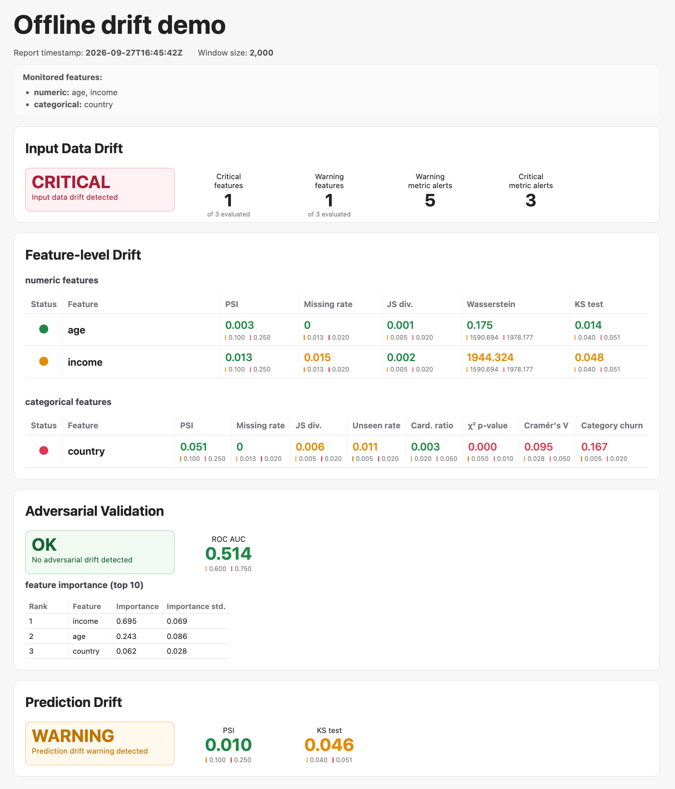

# Офлайн-анализ и HTML-отчёт

Офлайн-режим сравнивает готовые выборки `reference` и `current` без Kafka, Prometheus и Grafana. Анализатор рассчитывает метрики дрифта относительно reference-профиля и возвращает структурированный отчёт. Adversarial Validation (AV) можно запустить отдельно, а затем собрать результаты в автономный HTML-файл.

Сценарий подходит для разовой проверки данных, анализа исторических выборок и передачи отчёта без доступа к дашборду.

---

## Быстрый пример

```python
import pandas as pd

from drift_guardian.analyzer.offline.offline_mode import OfflineWrapper
from drift_guardian.config_handler.auto_config_builder import ConfigBuildOptions
from drift_guardian.reporting import generate_html_report

# Подготовка reference и current
reference_df = pd.read_csv("data/reference.csv")
current_df = pd.read_csv("data/current.csv")

# Шаг 1. Создание анализатора и reference-профиля
analyzer = OfflineWrapper(
    reference_df=reference_df,
    config_options=ConfigBuildOptions(
        prediction_enabled=True,
        prediction_score_column="prediction_score",
    ),
)

# Шаг 2. Анализ current-данных
report = analyzer.analyze_df(current_df)

# Опционально: Adversarial Validation
av_report = analyzer.run_av(
    current_df,
    prediction_col="prediction_score",
)

# Шаг 3. Создание HTML-отчёта
html_path = generate_html_report(
    report=report,
    av_report=av_report,
    dataset_name="Offline drift demo",
    output_path="reports/offline_drift_report.html",
)
```

Для сценария без AV уберите вызов `run_av()` и аргумент `av_report`. Если мониторинг предсказаний не нужен, не задавайте в `ConfigBuildOptions` параметры `prediction_enabled` и `prediction_score_column`.

HTML-отчёт будет сохранён по пути `reports/offline_drift_report.html`. Этот же путь вернёт `generate_html_report()` в переменной `html_path`.

---

## Подготовка и анализ данных

### Reference-профиль

`OfflineWrapper` принимает reference-выборку как `DataFrame`. Он использует готовую конфигурацию или создаёт её по `ConfigBuildOptions` и рассчитывает эталонные статистики по reference-данным. В примере включён мониторинг колонки `prediction_score`; остальные настройки берутся по умолчанию. Параметры автогенерации описаны в [configuration.md](configuration.md).

`current_df` — выборка для сравнения с reference. Её можно подготовить из CSV, Parquet или другого источника и передать как `DataFrame`. В обеих выборках должны присутствовать анализируемые признаки.

### Drift report

```python
report = analyzer.analyze_df(current_df)
```

Метод рассчитывает настроенные метрики для `current_df`, сравнивает их с порогами reference-профиля и возвращает словарь `report`. В нём находятся метаданные, общий статус, статусы признаков, значения и статусы отдельных метрик, а при включённом мониторинге — результаты для предсказаний. Размер переданного `current_df` отражается в `window_size` отчёта.

Описание метрик и порогов — в [metrics.md](metrics.md).

### Adversarial Validation (опционально)

```python
av_report = analyzer.run_av(current_df, prediction_col="prediction_score")
```

AV обучает LightGBM различать строки `reference` и `current`. Метод возвращает кортеж из ROC AUC по out-of-fold предсказаниям и таблицы важности признаков для этого различения. Значение AUC около 0.5 означает, что модель почти не различает выборки; более высокое значение указывает на возможные различия. Это индикатор дрифта, а не оценка качества рабочей модели.

В примере `prediction_score` исключается из признаков AV через `prediction_col`. Если такой колонки нет, этот аргумент можно не передавать. Подробнее — в [adversarial-validation.md](adversarial-validation.md).

---

## HTML-отчёт

`generate_html_report()` принимает словарь `report` или путь к сохранённому JSON-отчёту, встраивает CSS и записывает автономный HTML-файл. Функция возвращает путь к нему.

| Параметр | Назначение |
|---|---|
| `report` | Результат `analyze_df()` либо путь к JSON-файлу |
| `av_report` | Результат `run_av()`; при отсутствии раздел AV не создаётся |
| `dataset_name` | Название датасета в заголовке |
| `output_path` | Путь для записи HTML-файла |
| `css_path` | Путь к CSS; по умолчанию используется стиль из пакета |

В заголовке показаны название датасета, время анализа, размер текущей выборки и список анализируемых признаков. Затем идут разделы:

- **Input Data Drift** — общий статус, число признаков со статусами `warning` и `critical`, а также количество метрик с этими статусами.
- **Feature-level Drift** — отдельные таблицы для числовых и категориальных признаков. В ячейках указаны значения метрик и пороги `warning`/`critical`; цвет значения и маркер строки показывают статусы метрики и признака. Колонки формируются из метрик, присутствующих в результате анализа.
- **Adversarial Validation** — статус AV, ROC AUC с порогами 0.60 и 0.75 и таблица до десяти признаков с наибольшей важностью. Раздел появляется, если передан `av_report`.
- **Prediction Drift** — отдельный статус и карточки метрик предсказаний с их значениями и порогами. Раздел появляется, если данные предсказаний есть в `report`.

HTML можно открыть в браузере или показать прямо в Jupyter:

```python
from drift_guardian.reporting import display_html_report

display_html_report(html_path, height=1300)
```

### Из сохранённого JSON

Если результат анализа уже сохранён, HTML можно создать без повторного расчёта метрик:

```python
generate_html_report(
    report="reports/drift_report.json",
    dataset_name="Offline drift demo",
    output_path="reports/offline_drift_report.html",
)
```

CLI принимает входной JSON и путь к выходному HTML. Он формирует отчёт из сохранённого drift report без отдельного `av_report`, поэтому раздел AV в таком варианте не появится.

CLI создаёт HTML из сохранённого JSON-отчёта. Чтобы добавить результаты AV, используйте Python API: CLI пока не принимает `av_report`.

---

## Демонстрационный ноутбук

[`notebooks/offline_report_demo.ipynb`](/notebooks/offline_report_demo.ipynb) последовательно создаёт две выборки с контролируемыми изменениями, запускает `analyze_df()` и AV, затем показывает полученный HTML-отчёт. Для запуска ноутбука установите зависимости группы `notebooks`:

```bash
uv sync --frozen --group notebooks
```

На примере двух искусственно созданных выборок ноутбук формирует отчёт ниже: в `current` заранее внесены изменения, поэтому можно сопоставить их с результатами drift-анализа.




---

## Связанные документы

- [metrics.md](metrics.md) — drift-метрики и пороги
- [adversarial-validation.md](adversarial-validation.md) — метод AV и интерпретация результата
- [configuration.md](configuration.md) — настройки конфигурации
- [reference-data.md](reference-data.md) — подготовка reference-данных
